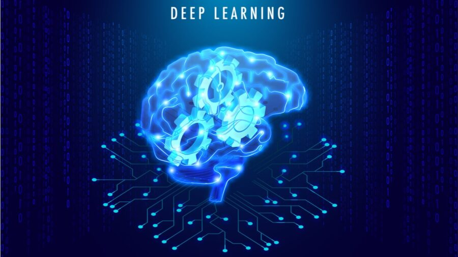
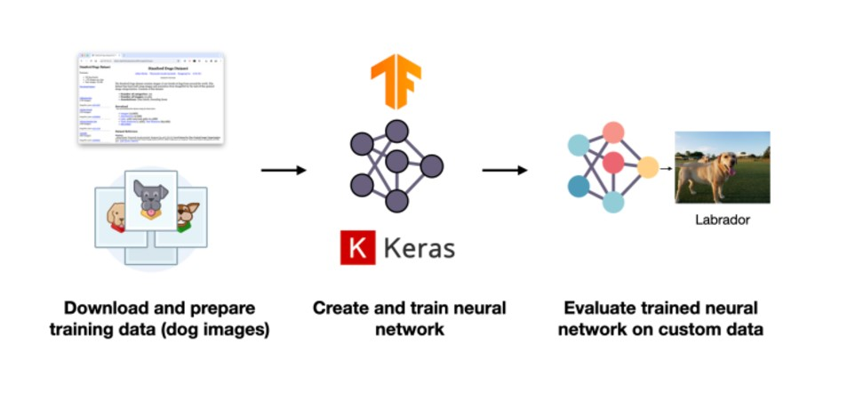
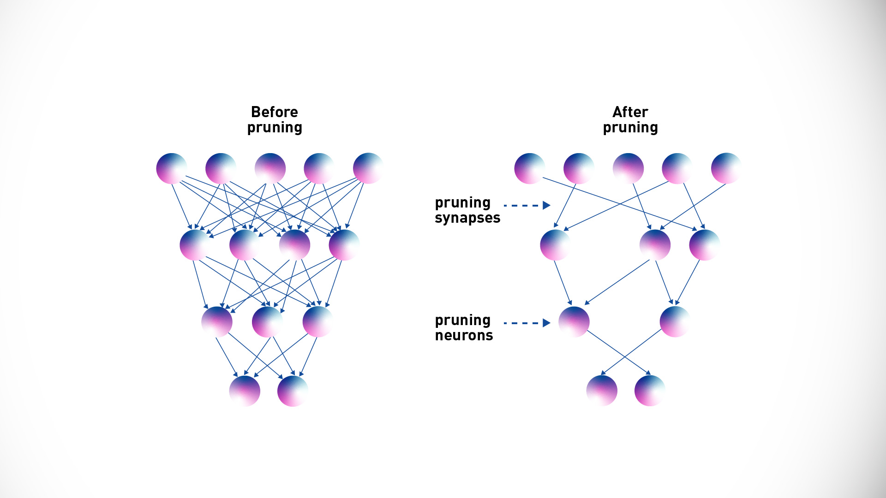

# Alphabet Soup Charity - Deep Learning Model

## Overview of the Analysis
The purpose of this analysis is to build a binary classifier using a deep learning neural network. This model predicts the success of applicants funded by Alphabet Soup, helping the organization select applicants with the highest likelihood of success in their ventures.

I worked on developing a *Neural Network model*

### Data Preprocessing
- **Target Variable**:
  - `IS_SUCCESSFUL`

- **Features**: 
  - `APPLICATION_TYPE`
  - `AFFILIATION`
  - `CLASSIFICATION`
  - `USE_CASE`
  - `ORGANIZATION`
  - `STATUS`
  - `INCOME_AMT`
  - `SPECIAL_CONSIDERATIONS`
  - `ASK_AMT`

- **Removed (Dropped) Variables**: 
  - `EIN`: Identification column not relevant to predictions.
  - `NAME`: Identification column that may introduce noise without adding predictive value.
- **Handling Categorical Data**: Categorical variables with more than 10 unique values were grouped into an "Other" category. and One-hot encoding was applied to categorical features to convert them into numeric
format.
- **Scaling the Features**: StandardScaler was used to normalize numerical data to ensure consistency and improve model convergence.
- **Data Splitting**: The dataset was split into training (80%) and testing (20%) sets using train_test_split.

### Compiling, Training, and Evaluating the Model
- **Model Structure**:
  - **Neurons**: Initial configurations used between 30 and 200 neurons per layer.
  - **Hidden Layers**: Multiple attempts with 2-5 layers to balance complexity and training efficiency.
  - **Activation Functions**: `relu` for hidden layers and `sigmoid` for the output layer (binary classification).

- **Performance**:
  - Initial attempts achieved ~73% accuracy.
  - Various techniques were used to optimize performance, including:
    - Adjusting neurons and layers.
    - Using dropout and batch normalization.
    - Adjusting learning rate and adding callbacks.

### Optimization Steps
To achieve a target accuracy of 75%, the following optimizations were attempted:
1. **Data Adjustments**:
   - Encoding categorical variables with `pd.get_dummies()`.
   - Combining rare categorical values into "Other".
   - Scaling features using `StandardScaler()`.

2. **Model Adjustments**:
   - Increased the number of neurons in hidden layers.
   - Added more hidden layers for greater learning capacity.
   - Experimented with different activation functions (`relu`, `tanh`).

3. **Training Adjustments**:
   - Increased the number of epochs.
   - Used EarlyStopping and ModelCheckpoint callbacks to improve training efficiency.

### Final Model
- **Accuracy**: Despite extensive optimization, the highest accuracy achieved was ~73%.
Then I had to try different approach that is focused on identifying and handling low-frequency categories in a dataset:
* *Replacing with "Other"*: Consolidate rare categories into a single "Other" category.
* *Dropping*: Remove the data associated with these rare categories (only if justified).
* *Encoding Separately*: Treat them differently in downstream processing.

### Questions
- Which features were used as inputs?
Categorical features as application type, organization type, special considerations were utilized, transformed into numerical data using one-hot encoding.

- What was the target variable?
The target variable was *IS_SUCCESSFUL*, which represents whether the charity was successful.

- What methods were used to preprocess the data?
The data was prepared by removing non-essential columns, applying one-hot encoding for categorical variables, scaling numerical features with StandardScaler, and splitting the dataset into training and testing subsets.

- How was the model structured?
The model was a neural network with first one hidden layer then increased by 5 comprising 30 and 200 neurons, using ReLU activation for hidden layers and a Sigmoid function for the output layer.

- What were the model’s performance metrics?
The optimized model achieved an accuracy of 72%-73% and showed a reduced loss value, starting from 0.577 and improving during the optimization process.

- How was the model optimized?
Optimization included:
* Modifying the architecture by experimenting with layers and neurons.
* Tuning hyperparameters like learning rate and increasing training epochs.
* Incorporating early stopping to mitigate overfitting.

### Summary
- The deep learning model performed well but did not achieve the target accuracy of 75%, by adding hidden layers.
- Recommendation:
  - Perform feature importance analysis to focus on the most predictive variables.

